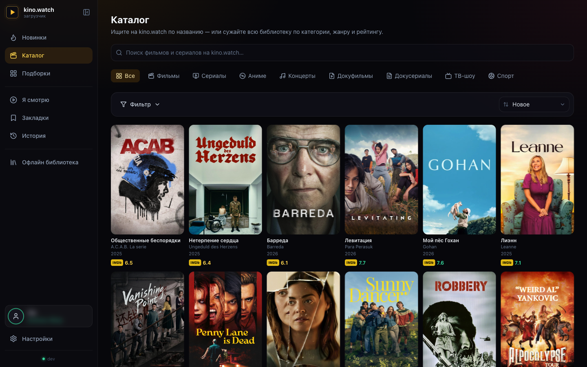
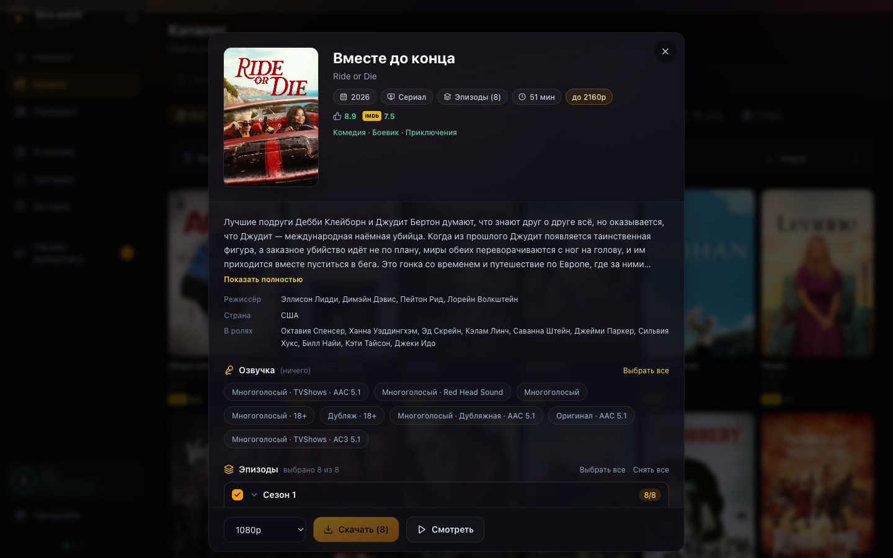
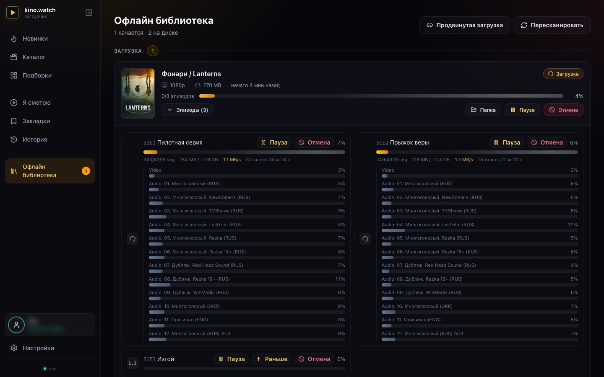
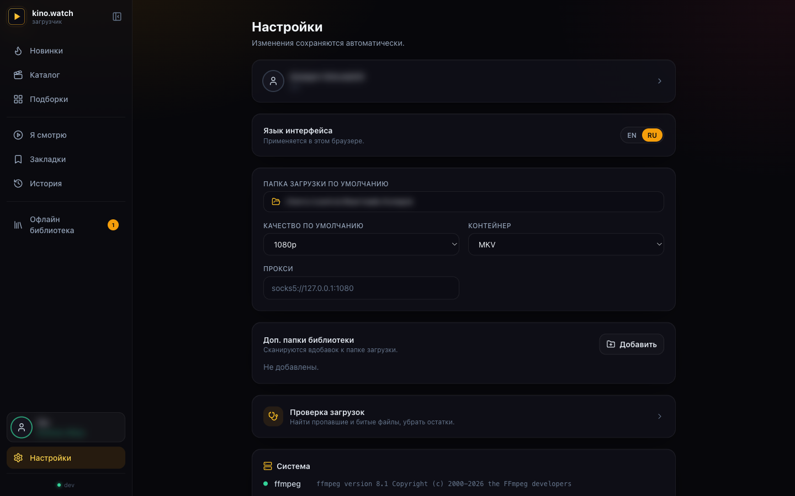

<p align="right"><b>Русский</b> · <a href="README.en.md">English</a></p>

# kino.watch downloader · GUI

**Программа для скачивания с [kino.watch](https://kino.watch) с нормальным интерфейсом.** Запускаете — открывается вкладка в браузере. Ищете по каталогу, смотрите превью прямо в плеере и качаете: фильмы и сериалы целиком, со всеми озвучками и субтитрами. Пока идёт загрузка, видно прогресс по каждому эпизоду — скорость и сколько осталось.

Войти нужно один раз, по короткому коду устройства. Внутри ничего лишнего: один файл, без Electron и без Node (Go-сервер со встроенным интерфейсом на React). Запустили — и пользуетесь.

<p align="center">
  
</p>

<p align="center">
  
  
  
  
  
</p>

---

## Возможности

- 🎬 **Просмотр каталога** — поиск, топы, подборки, фильтры по жанру и стране, диапазоны по году и рейтингу IMDb/Кинопоиск, ваша история просмотров и «продолжить просмотр», а также страница тайтла с описанием, актёрами, рейтингами и полным деревом сезонов и эпизодов.
- ▶️ **Встроенный плеер** — посмотрите превью любого тайтла прямо в приложении, прежде чем качать. Поток идёт через само приложение, так что в браузере ничего настраивать не нужно.
- 🗂️ **Выбор файла, а не «качества»** — список показывает то, что сервис действительно отдаёт: «2160p · HEVC», «2160p · H.264», «1080p · H.264». Рядом покрытие по сериям («· 200/338»), потому что сезоны бывают закодированы неодинаково.
- 📺 **Подгонка под плеер в авторежиме** — кадр выше 2160 уменьшается по высоте, 4K H.264 выше 30 к/с делится пополам (48 → 24). Телевизоры отказываются от таких файлов и уходят в софтверное декодирование с рывками; всё, что и так играется, копируется без перекодирования.
- 🔊 **Выбор озвучек по-настоящему** — список берётся из плейлиста, а не из краткого описания, и правило отбора строится по точному имени дорожки, поэтому «MTV» не притаскивает украинскую версию заодно.
- 💬 **Субтитры — выбором** — раздел свёрнут и по умолчанию не выбрано ничего: сервис отдаёт десятки языков на эпизод, и качать их все незачем. Форсированные дорожки помечены.
- ⚡ **Живое состояние** — на карточке видно не только проценты, но и что именно идёт: скачивание, склейка, перекодирование (с итоговым кадром, кодеком, энкодером и числом занятых ядер) или перенос в папку загрузки.
- ⏯️ **Управление на лету** — пауза, отмена и повтор по каждому эпизоду отдельно; пауза именно останавливает загрузку, а не подменяет её следующей серией. Очередь переживает перезапуск и докачивается с места остановки.
- 📁 **Понятные имена и папки** — фильм сохраняется одним файлом со своим названием, сериал — папкой с сезонами и названиями серий. Временные файлы можно вынести на другой диск: на HDD это почти вся скорость.
- 📚 **Библиотека** — активные загрузки и всё уже скачанное на одной странице: размеры, разрешения, обнаружение пропавших файлов; откройте готовый файл или покажите его папку.
- 🔐 **Вход один раз** — авторизация по короткому коду устройства; токены хранятся в зашифрованном виде и привязаны к машине. Локальные функции (Библиотека, Настройки) работают и без входа.
- 🌍 **Два языка** — английский и русский, переключаются в один клик (запоминается между сессиями).
- 📦 **Один бинарник** — интерфейс встроен внутрь; самообновление из релизов на GitHub.

## Скриншоты

| Просмотр каталога | Карточка тайтла |
| --- | --- |
|  |  |

| Загрузки вживую | Настройки |
| --- | --- |
|  |  |

---

## Требования

- **ffmpeg** — им приложение склеивает видео, звук и субтитры в один файл. Если он стоит в системе (есть в `PATH`), приложение подхватит его само; на странице «Настройки» видно зелёную или красную отметку для `ffmpeg` и `ffprobe`.
  ```bash
  brew install ffmpeg          # macOS
  sudo apt install ffmpeg      # Debian/Ubuntu
  ```
  ```powershell
  winget install Gyan.FFmpeg   # Windows (или: choco install ffmpeg / scoop install ffmpeg)
  ```
  На Windows убедитесь, что `ffmpeg.exe` и `ffprobe.exe` есть в `PATH` (менеджеры пакетов выше делают это сами) — страница «Настройки» подтвердит, что оба найдены.

  **Не хотите ставить руками?** Если ffmpeg не найден, нажмите **Настройки → Система → Установить ffmpeg** (такая же кнопка есть на странице «Загрузка») — приложение само скачает готовую сборку под вашу систему и дальше будет пользоваться ей. В систему ничего не прописывается, права администратора не нужны.
- Браузер (приложение открывается в том, что стоит по умолчанию).
- Аккаунт kino.watch с активной подпиской — без неё не будет ни каталога, ни просмотра, ни загрузок.

## Установка и запуск

**Готовые клиенты под все основные системы** — берите со [страницы релизов](https://github.com/bartmaksimpson-cloud/kinopub-gui/releases):

- 🍎 **macOS** — приложение в строке меню (`.dmg`) и отдельные бинарники, Apple Silicon (`arm64`) и Intel (`amd64`)
- 🪟 **Windows** — исполняемый файл `x64` (`amd64`), без окна консоли и с встроенной иконкой
- 🐧 **Linux** — `x64` (`amd64`, с иконкой в системном трее; также `AppImage`) и `ARM64`
- 🤖 **Android** — `ARM64` (без системного трея, веб-интерфейс как обычно; запускается под Termux)

Везде один и тот же бинарник — React-интерфейс встроен внутрь, так что больше ничего ставить не нужно.

### Вариант A — скачать готовый бинарник

Возьмите `kinopub-gui-*` под вашу платформу со [страницы релизов](https://github.com/bartmaksimpson-cloud/kinopub-gui/releases) и запустите:

```bash
chmod +x kinopub-gui-darwin-arm64
./kinopub-gui-darwin-arm64
# → откроет http://127.0.0.1:8765 в браузере
```

На **macOS** можно вместо этого взять `.dmg` и перетащить **KinoPub** в Applications — приложение живёт в строке меню (без иконки в Dock; в пункте строки состояния есть *Open* и *Quit*).

Приложение не подписано сертификатом Apple, поэтому первый запуск macOS заблокирует. Открывается один раз вручную:

1. Перетащите **KinoPub** из образа в папку **Программы** (Applications) и запустите оттуда.
2. macOS предупредит, что не может проверить приложение, — закройте окно (**Готово**).
3. Откройте **Системные настройки → Конфиденциальность и безопасность**, прокрутите вниз до сообщения про KinoPub и нажмите **Все равно открыть**, затем подтвердите паролем или Touch ID.

Дальше приложение открывается как обычно. На старых macOS (Sonoma и раньше) достаточно правого клика по приложению → **Открыть** → **Открыть**.

На **Windows** скачайте `kinopub-gui-windows-amd64.exe` и запустите его (двойным щелчком или из терминала):

```powershell
.\kinopub-gui-windows-amd64.exe
# → откроет http://127.0.0.1:8765 в браузере
```

> Бинарник не подписан, поэтому при первом запуске SmartScreen / Gatekeeper может предупредить — на Windows выберите **Подробнее → Выполнить в любом случае**, на macOS — шаги выше (**Конфиденциальность и безопасность → Все равно открыть**). Брандмауэр Windows тоже может спросить; сервер работает только локально, поэтому достаточно разрешить доступ в частной сети. Учётные данные хранятся в зашифрованном виде в `~/.config/kinopub/credentials.enc` (`%USERPROFILE%\.config\kinopub\credentials.enc` на Windows).

### Вариант B — сборка из исходников

Понадобятся Go 1.26+ и Node 20+ (только для сборки интерфейса; во время работы не нужны).

```bash
git clone https://github.com/bartmaksimpson-cloud/kinopub-gui
cd kinopub-gui
make run          # собирает веб-интерфейс, бинарник GUI и запускает его
```

Или по шагам:

```bash
make web          # собрать React-фронтенд в web/dist (встраивается через go:embed)
make gui          # собрать бинарник ./kinopub-gui
./kinopub-gui
```

> **Распространение:** берите готовые бинарники со [страницы релизов](https://github.com/bartmaksimpson-cloud/kinopub-gui/releases) или собирайте через `make`. `web/dist` закоммичен, поэтому обычный `go build ./cmd/kinopub-gui` тоже даёт готовый к запуску бинарник, а `make web` пересобирает интерфейс.
>
> `go install` здесь не подходит: путь Go-модуля остался от исходного проекта (`github.com/ZioSHik/kinopub-gui`), и установка по нему принесёт чужой код, а не этот.

### Флаги

```
kinopub-gui [flags]
  -addr      address to listen on (default 127.0.0.1:8765;
             falls back to an ephemeral port if taken)
  -no-open   do not open the browser automatically
  -version   print version and exit
```

Сервер слушает только на вашем компьютере (`127.0.0.1`) — это не публичный сервис, снаружи к нему не подключиться. Вдобавок он отклоняет чужие запросы, чтобы посторонняя страница в браузере не могла им потихоньку воспользоваться.

### Обновление

Готовые сборки обновляются сами. **Настройки → Обновление ПО** показывает текущую
версию, а если на GitHub вышла новее — кнопку **Обновить и перезапустить**. По нажатию
приложение скачивает новую сборку под вашу систему, сверяет контрольную сумму, заменяет
себя на месте и перезапускается; открытая вкладка браузера подхватится сама. (Сборки из
исходников помечены как `dev` и сами не обновляются — пересоберите через `make`.)

---

## Как пользоваться

### 1. Вход

Локальные функции — **Библиотека, Настройки, выбор папки** — работают без входа. Каталог, поиск, встроенный плеер и загрузки требуют аккаунт.

Нажмите **Войти** (вверху справа или в боковой панели) и:

1. Приложение покажет короткий **код устройства** и ссылку (`kino.watch/device`).
2. Откройте эту ссылку в любом браузере, где вы залогинены в kino.watch, и введите код.
3. Подтвердите — приложение распознает это за пару секунд, и вы внутри.

Устройство появится в списке устройств вашего аккаунта kino.watch как `kinopub-gui (имя-компьютера)`. Токены хранятся зашифрованными, привязаны к вашему компьютеру и лежат в `~/.config/kinopub/credentials.enc`. Выйти можно в любой момент из «Настроек».

> **kino.watch часто недоступен без VPN.** Если вход, каталог или загрузки зависают или отваливаются по таймауту, включите VPN или укажите прокси (Настройки → Прокси либо для конкретной загрузки в «Дополнительно»). Интерфейс показывает напоминание и определяет таймауты.

### 2. Найти что-нибудь

Откройте **Каталог**, чтобы искать и просматривать. Фильтруйте по типу, жанру, стране, диапазону лет и рейтингу IMDb/Кинопоиск; смотрите топы и подборки; или возвращайтесь к строкам **истории** и **продолжить просмотр**. Откройте тайтл, чтобы увидеть детали, рейтинги, доступные озвучки и полное дерево сезонов и эпизодов — и нажмите ▶, чтобы **посмотреть превью во встроенном плеере** перед загрузкой.

Также можно вставить ссылку kino.watch прямо на странице **Загрузка**, если она у вас уже есть.

### 3. Загрузка

Из страницы тайтла (или со страницы «Загрузка») отметьте нужные сезоны и эпизоды, выберите качество и нажмите **Начать загрузку**. Прогресс появляется в **Офлайн библиотеке**, в разделе «Загрузка» над скачанным, — общий, по каждому эпизоду и по каждой дорожке, со скоростью и оставшимся временем. Любой эпизод можно поставить на паузу, отменить или передвинуть вперёд, не трогая остальные; очередь переживает перезапуск приложения и докачивается с места остановки.

Под кнопкой **Дополнительно** — тонкая настройка: контейнер (MKV / MP4), прокси (HTTP/HTTPS/SOCKS5), тоггл «Перекачать заново», подробные логи и поле для своих аргументов ffmpeg. Поля подставляются из «Настроек», так что обычно тут ничего трогать не нужно.

### 4. Аудиодорожки

Озвучки выбираются прямо там, где вы начинаете загрузку:

- **Со страницы тайтла** в каталоге — в блоке «Озвучка» отметьте галочками дорожки, которые хотите оставить («Выбрать все» / «Снять все»). Выбор запоминается и подставляется на следующих тайтлах; если вашей прошлой озвучки тут нет, приложение подскажет выбрать другую.
- **При загрузке по прямой ссылке** (страница «Загрузка») выбор всплывает таймерным окном уже при старте: отметьте нужные дорожки, «Только эта» — оставить одну, «Оставить все» — взять всё (то же срабатывает по истечении таймера).

Выбор обобщается по всем эпизодам и сопоставляется по языку: если выбранной озвучки в каком-то эпизоде нет, движок берёт другую дорожку на том же языке. По умолчанию сохраняются все дорожки.

### 5. Библиотека

**Библиотека** сканирует ваши папки вывода и показывает всё скачанное — с постерами, размерами и отметками файлов, пропавших с диска. Активные загрузки живут на этой же странице, над скачанным. Откройте или покажите любой файл прямо из списка; ненужный эпизод или целый тайтл можно удалить с диска оттуда же.

### 6. Настройки

Значения по умолчанию для новых загрузок, вход в kino.watch, установщик ffmpeg и обновление ПО. Хранятся в `~/.config/kinopub/gui.json`.

**Две папки, и они про разное:**

- **Куда сохранять готовые файлы** — сюда приезжает готовый фильм или серия, эту папку и открывает плеер или NAS.
- **Где держать рабочие файлы во время скачивания** — сегменты, склеенные дорожки и файл, который пишет ffmpeg. Всё это удаляется по готовности эпизода. Пусто — лежат рядом с готовым файлом. На жёстком диске вынести их на **другой** диск — это почти вся скорость: иначе одна головка одновременно читает и пишет. Нужно примерно три размера эпизода.

Путь можно вписать руками — так открывается сетевая папка (`\\192.168.1.174\Video`, `/Volumes/NAS`), а перед сохранением приложение проверяет папку на запись: шара, доступная только для чтения, видна сразу, а не после скачанных гигабайт.

**Пределы для плеера** (по умолчанию включены): максимальная высота кадра 2160 и максимальная частота 30 к/с для 4K. Файл, который в них укладывается, копируется без перекодирования — настоящий 4K остаётся нетронутым. Перекодирование с 00:00 до 09:00 занимает все ядра, в остальное время оставляет одно свободным, чтобы за компьютером можно было работать.

Скорость настраивать не нужно — приложение считает её само. Структура фиксированная: один тайтл за раз (остальные ждут в очереди, порядок можно менять) и две серии параллельно внутри него — больше не ускоряет, канал и так занят, только дробит его и множит соединения к CDN.

А вот число сегментов, качаемых одновременно, подбирается под ваш канал на ходу: загрузчик меряет реальную скорость окнами по 4 секунды и поднимает параллельность, пока она растёт; на плато останавливается и держится, при просадке отступает на шаг. Раз в полминуты пробует снова — канал же меняется (перешли с Wi-Fi на кабель, закончился созвон). Потолок — 16, пол — по одному слоту на дорожку, чтобы аудио всегда качалось вместе с видео. Если CDN отвечает 429 или 503, параллельность режется вдвое немедленно, а пауза берётся из заголовка `Retry-After` — то есть ровно та, о которой попросил сервер, а не выдуманная нами. Сетевые сбои поверх этого разбираются повторами с нарастающей паузой (1→2→4→8→16 с).

---

## Как это устроено

```
┌──────────────────────────────┐        SSE (live progress)        ┌───────────────────────┐
│  React + TS + Tailwind UI     │ ◀───────────────────────────────── │  Go HTTP server       │
│  (embedded via go:embed)      │ ──── REST (commands) ────────────▶ │  internal/gui         │
└──────────────────────────────┘                                    └─────┬───────────┬─────┘
                                                                          │ drives    │ API
                                                          ┌───────────────▼──┐   ┌────▼──────────────┐
                                                          │ kinopub engine    │   │ kino.watch API      │
                                                          │ internal/app +    │   │ services/kinopubapi│
                                                          │ services (HLS,    │   │ (device login,    │
                                                          │ downloader, …)    │   │ discovery, stream)│
                                                          └───────────────────┘   └───────────────────┘
```

Сервер не запускает движок отдельным процессом, а работает с ним напрямую в одной программе: прогресс загрузки уходит в браузер живым потоком, выбор озвучки всплывает окном и держит загрузку до вашего ответа, а лог движка виден в логе каждой задачи.

Каталог и просмотр работают через `internal/services/kinopubapi` — небольшой клиент к API kino.watch: он держит вход и сам обновляет токены. Плеер получает видео через `/api/hls` — это прокси внутри самого приложения; каждая ссылка подписана, так что использовать его как чужой открытый прокси не выйдет.

### Структура проекта

```
cmd/
  kinopub-gui/      входная точка GUI-сервера (встраивает UI, открывает браузер, трей для macOS/Windows)
internal/
  app/kinopub/      корень композиции движка (App.Run)
  domain/           порты и модели
  services/
    kinopubapi/     клиент API kino.watch (вход устройства, обнаружение, разрешение потока)
    downloader/     загрузка HLS + файлов, сборка через ffmpeg
    hlsdownloader/  разбор HLS-манифестов и загрузка сегментов
    statestore/     .kinopub-state.json по каждому сериалу
    …               outputlayout, scheduler, progress, proxyprovider
  gui/              REST + SSE сервер, менеджер задач, обнаружение, HLS-прокси плеера, reporter/chooser
  lib/              credstore (шифр. учётки), httpx (uTLS), logx, audiomenu, …
web/                фронтенд React + Vite + Tailwind
  dist/             собранный UI, встроенный в бинарник (go:embed)
```

## Разработка

```bash
# Терминал 1 — запустить Go-сервер (раздаёт встроенный UI + API)
make gui && ./kinopub-gui

# Терминал 2 — фронтенд с горячей перезагрузкой и прокси API на :8765
make dev            # → http://localhost:5173
```

`make vet` запускает `go vet`, `make test` — набор тестов. CI собирает интерфейс, прогоняет vet и тесты (включая детектор гонок) на Linux, Windows и macOS.

## Благодарности

Этот репозиторий — форк **[ZioSHik/kinopub-gui](https://github.com/ZioSHik/kinopub-gui)**; релизы и самообновление идут отсюда, из [bartmaksimpson-cloud/kinopub-gui](https://github.com/bartmaksimpson-cloud/kinopub-gui).

- Движок загрузки и сложные части, из которых он вырос (HLS, повторы, шифрование учётных данных): **[niazlv/kinopub-downloader](https://github.com/niazlv/kinopub-downloader)**.
- Веб-интерфейс, интеграция каталога/плеера и упаковка (`cmd/kinopub-gui`, `internal/gui`, `internal/services/kinopubapi`, `web/`): вышестоящий проект.
- Выбор кодека и подгонка под плеер, выбор субтитров, рабочая папка, имена файлов и живое состояние загрузки: этот форк.

## Лицензия

MIT — см. [LICENSE](LICENSE). Вышестоящий движок под лицензией MIT; этот репозиторий сохраняет её и добавляет GUI на тех же условиях.
